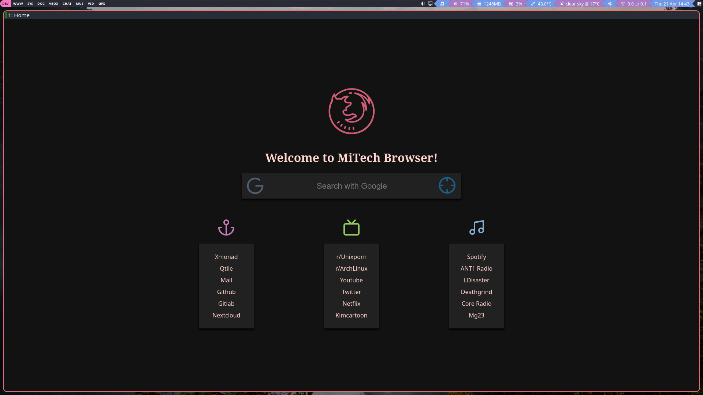
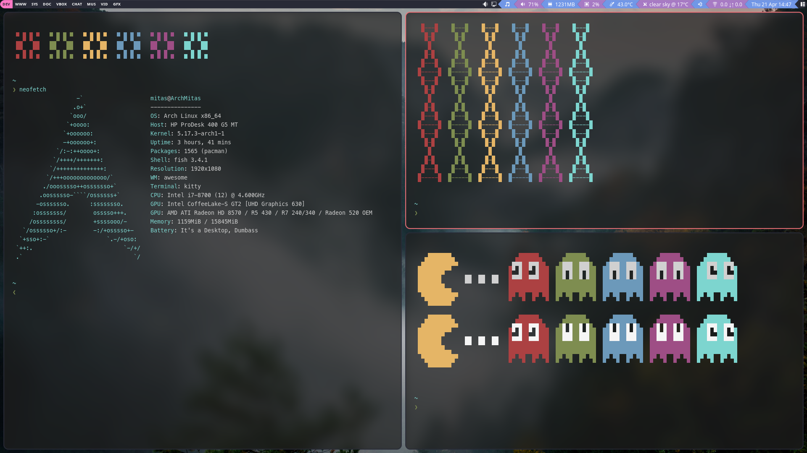

# Mitas-Awesome

## Material and Mouse driven theme for [AwesomeWM 4.3](https://awesomewm.org/)
### Original design by DT(DistroTube), I modified it changing keybindings, adding my repos in to make cerain apps work correctly, and modifying the dmscripts section to work on this WM. 

Note: This fork focuses on streamlining the config and adding some Quality of Life touches to the theme.


|     Desktop   | Mitas Browser | Mitas Terminal|
|:-------------:|:-------------:|:-------------:|
|||

## Installation

### 1) Get all the dependencies

#### Debian-Based

```
sudo apt install awesome fonts-roboto qutebrowser rofi compton i3lock xclip qt5-style-plugins kitty materia-gtk-theme lxappearance feh volumeicon-alsa xbacklight flameshot nautilus dmenu xfce4-power-manager pnmixer network-manager-gnome policykit-1-gnome -y
```

#### Arch-Based

```
yay -S awesome rofi picom dmenu volumeicon qutebrowser feh i3lock-fancy xclip ttf-roboto polkit-gnome alacritty materia-theme lxappearance flameshot pnmixer network-manager-applet xfce4-power-manager qt5-styleplugins -y
```

#### Program list

- [AwesomeWM](https://awesomewm.org/) as the window manager - universal package install: awesome
- [Roboto](https://fonts.google.com/specimen/Roboto) as the **font** - Debian: fonts-roboto Arch: ttf-roboto
- [Rofi](https://github.com/DaveDavenport/rofi) for the app launcher - universal install: rofi
- [picom](https://github.com/yshui/picom) for the compositor (blur and animations) universal install: picom - Debian users need PPA (`sudo add-apt-repository ppa:regolith-linux/unstable`) _Note: I recommend Compton for Debian Users and the Debian Branch_
- [i3lock](https://github.com/meskarune/i3lock-fancy) the lockscreen application universal install: i3lock-fancy
- [xclip](https://github.com/astrand/xclip) for copying screenshots to clipboard package: xclip
- [gnome-polkit] recommend using the gnome-polkit as it integrates nicely for elevating programs that need root access
- [Materia](https://github.com/nana-4/materia-theme) as GTK theme - Arch Install: materia-theme debian: materia-gtk-theme
- [Papirus Dark](https://github.com/PapirusDevelopmentTeam/papirus-icon-theme) as icon theme Universal Install: wget -qO- https://git.io/papirus-icon-theme-install | sh
- [lxappearance](https://sourceforge.net/projects/lxde/files/LXAppearance/) to set up the gtk and icon theme
- (Laptop) [xbacklight](https://www.x.org/archive/X11R7.5/doc/man/man1/xbacklight.1.html) for adjusting brightness on laptops (disabled by default)
- [flameshot](https://flameshot.org/) my personal screenshot utility of choice, can be replaced by whichever you want, just remember to edit the apps.lua file
- [pnmixer](https://github.com/nicklan/pnmixer) Audio Tray icon that is in debian repositories and is easily installed on arch through AUR.
- [network-manager-applet](https://gitlab.gnome.org/GNOME/network-manager-applet) nm-applet is a Network Manager Tray display from GNOME.
- [xfce4-power-manager](https://docs.xfce.org/xfce/xfce4-power-manager/start) XFCE4's power manager is excellent and a great way of dealing with sleep, monitor timeout, and other power management features.

### 2) Clone the configuration

Arch-Based Installs
```
git clone https://github.com/MitasTech/Mitas-Awesome ~/.config/awesome
```

Debian-Based Installs
```
git clone --branch debian https://github.com/MitasTech/Mitas-Awesome ~/.config/awesome
```

### 3) Clone the Custom Qutebrowser config and CarnelianOS to use the custom browser and custom search engines.

My CarnelianOS
```
git clone https://github.com/MitasTech/CarnelianOS
```
My Custom Qutebrowser
```
git clone https://github.com/MitasTech/qutebrowser ~/.config/qutebrowser
```

### 4) Set the themes

Start `lxappearance` to activate the **icon** theme and **GTK** theme.
Note: for cursor theme, edit `~/.icons/default/index.theme` and `~/.config/gtk3-0/settings.ini`, for the change to also show up in applications run as root, copy the 2 files over to their respective place in `/root`.

Recommended Cursors - <https://github.com/keeferrourke/capitaine-cursors>

Set Rofi Theme
```
mkdir -p ~/.config/rofi
cp $HOME/.config/awesome/theme/config.rasi ~/.config/rofi/config.rasi
sed -i '/@import/c\@import "'$HOME'/.config/awesome/theme/sidebar.rasi"' ~/.config/rofi/config.rasi
```

### 5) Same theme for Qt/KDE applications and GTK applications, and fix missing indicators

First install `qt5-style-plugins` (debian) | `qt5-styleplugins` (arch) and add this to the bottom of your `/etc/environment`

```bash
XDG_CURRENT_DESKTOP=Unity
QT_QPA_PLATFORMTHEME=gtk2
```

The first variable fixes most indicators (especially electron based ones!), the second tells Qt and KDE applications to use your gtk2 theme set through lxappearance.

